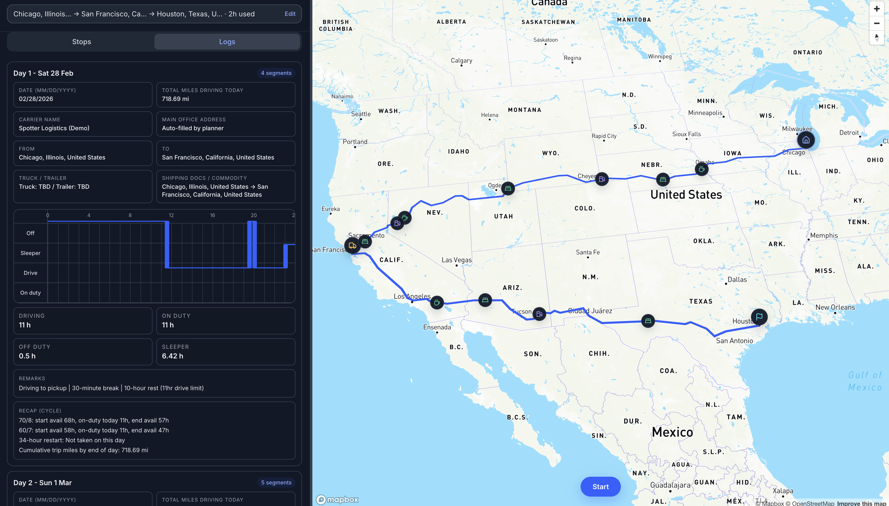
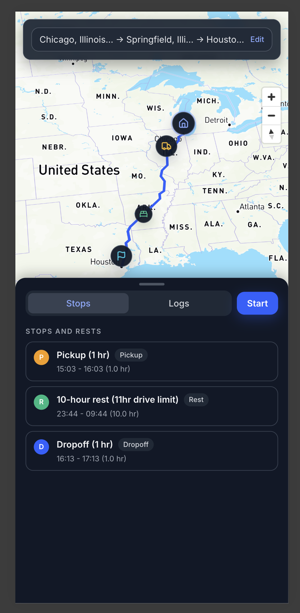

# Spotter Trip Planner (React + Django)

Live app: https://spotter-trip-planner-fullstack.netlify.app  
API: https://spotter-trip-planner-fullstack-production.up.railway.app  

Spotter Trip Planner is a full‑stack web application for planning truck trips under FMCSA Hours of Service (HOS) rules.Given current location, pickup, dropoff, and current cycle hours used, sthe system:

- computes a route (current → pickup → dropoff),
- plans fuel, rest, and sleeper stops,
- and produces DOT‑style daily log sheets with a continuous duty line.

---

## Overview and Features

- **Trip input form**
  - Fields for current location, pickup, dropoff, and cycle hours used.
  - Location typeahead backed by Mapbox Geocoding for cleaner inputs.

- **Route and stops visualisation**
  - Mapbox Directions used to draw the full route.
  - Distinct markers for:
    - current location,
    - pickup,
    - dropoff,
    - fuel stops,
    - short rest breaks,
    - long sleeper rests.
  - Clicking a stop recenters and zooms the map on that location.

- **HOS‑aware timeline**
  - Implements property‑carrying 70‑hour / 8‑day rules:
    - 11‑hour driving limit,
    - 14‑hour on‑duty window,
    - 30‑minute break after 8 hours of driving,
    - 10‑hour reset,
    - 34‑hour restart,
    - split‑sleeper logic.
  - Adds 1‑hour service time at pickup and dropoff.
  - Inserts fuel stops at least every 1,000 miles.

- **Daily log sheets**
  - One log per operating day.
  - Single continuous SVG polyline representing duty status over 24 hours (no overlapping segments).
  - Per‑day totals for driving and on‑duty hours.
  - Layout mirrors the standard paper log grid, and is printable from the browser.

- **Responsive user interface**
  - Desktop: left column (~35%) for form and logs, right column (~65%) for map, with resizable split.
  - Mobile: map as primary view, with the form pinned at the top and a swipe‑up bottom sheet for stops and logs.
  - Respects system dark/light theme preferences.

---

## Tech Stack

- **Frontend:** React (Vite), Tailwind CSS, Mapbox GL JS, lucide‑react icons  
- **Backend:** Django  
- **Mapping:** Mapbox Geocoding and Directions APIs  
- **Deployment:** Netlify (frontend), Railway with Docker + Gunicorn (backend)  
- **Languages:** JavaScript for the client, Python for the server

---

## Architecture

### Frontend

- Located in `frontend/`.
- Single‑page React application bootstrapped with Vite.
- Communicates with the backend via REST using `fetch`.
- API base URL is configured through the `VITE_API_URL` environment variable.

Key components:

- `src/App.jsx` – overall layout and wiring between form, map, and logs.  
- `src/components/TripForm.jsx` – trip form, inline validation, and typeahead suggestions.  
- `src/components/MapView.jsx` – Mapbox map, route polyline, and markers with zoom/center behaviour.  
- `src/components/LogsPanel.jsx` – daily log grid and SVG duty line drawing.  
- `src/components/BottomSheet.jsx` – mobile swipe‑up panel that toggles between stops and logs.

### Backend

- Located in `backend/`.
- Django project (`config`) with a `trips` application that encapsulates trip logic.
- Exposes two primary endpoints under `/api/`:
  - `/api/places/` – place suggestions for typeahead.
  - `/api/plan/` – trip planning, HOS timeline, and log generation.

Key modules:

- `trips/mapbox_client.py` – thin client around Mapbox Geocoding and Directions APIs.  
- `trips/timeline_engine.py` – HOS calculations and duty segments.  
- `trips/log_sheet_generator.py` – grouping segments into daily log sheets.  
- `trips/views.py` – Django views for the API endpoints.

Data flow (high level):

1. Client submits trip details to `/api/plan/`.  
2. Backend geocodes locations and calls Mapbox Directions to obtain legs and geometry.  
3. `timeline_engine` builds an HOS‑compliant list of duty segments with inserted breaks, fuel stops, and resets.  
4. `log_sheet_generator` groups these segments into daily logs.  
5. Response is returned as JSON and rendered by the React application.

---

## API Specification

Base URL (local): `http://localhost:8000`  
Base URL (production): `https://spotter-trip-planner-fullstack-production.up.railway.app`

### `GET /api/places/?q=<query>`

Returns a list of suggested locations for typeahead fields.

- **Query parameters**
  - `q` – search string, minimum length of 2 characters.

- **Response example**

```json
{
  "suggestions": [
    {
      "name": "Chicago, Illinois, United States",
      "coordinates": [-87.6298, 41.8781]
    }
  ]
}
```

### `POST /api/plan/`

Plans a trip and returns route, stops, and daily log sheets.

- **Request body (simplified)**

```json
{
  "current_location": "Chicago, IL",
  "pickup_location": "Springfield, MO",
  "dropoff_location": "Houston, TX",
  "current_cycle_used_hrs": 20,
  "current_location_coords": [-87.6298, 41.8781],
  "pickup_location_coords": [-93.2923, 37.2153],
  "dropoff_location_coords": [-95.3698, 29.7604]
}
```

- **Response (simplified)**

```json
{
  "route": { "...": "map and leg data" },
  "stops_and_rests": [
    { "type": "fuel", "description": "Fuel stop", "minute_offset": 320, "coords": [] },
    { "type": "rest", "description": "10-hour rest", "minute_offset": 660, "coords": [] }
  ],
  "log_sheets": [
    {
      "date": "2026-02-28",
      "total_driving_hours": 8.5,
      "total_on_duty_hours": 11.0,
      "segments": [
        { "status": "driving", "start_time": "...", "end_time": "...", "duration_minutes": 120 },
        { "status": "off_duty", "start_time": "...", "end_time": "...", "duration_minutes": 30 }
      ]
    }
  ]
}
```

---

## Project Structure

- `frontend/` – React + Vite application (trip form, map, logs, mobile bottom sheet).  
- `backend/` – Django project and `trips` app implementing API and HOS logic.

---

## Running Locally

### Backend

```bash
cd backend
python -m venv .venv
source .venv/bin/activate   # Windows: .venv\Scripts\activate
pip install -r requirements.txt
cp env.example .env         # configure MAPBOX_ACCESS_TOKEN and other variables
python manage.py runserver  # http://localhost:8000
```

### Frontend

```bash
cd frontend
npm install
cp env.example .env         # configure VITE_API_URL and VITE_MAPBOX_ACCESS_TOKEN if required
npm run dev                 # http://localhost:5173
```

Notes:

- If `VITE_API_URL` is not set, the frontend defaults to `http://localhost:8000`.  
- Maps require:
  - `MAPBOX_ACCESS_TOKEN` in `backend/.env`, and
  - optionally `VITE_MAPBOX_ACCESS_TOKEN` in `frontend/.env` for client‑side Mapbox.

Environment variables are documented in `backend/env.example` and `frontend/env.example`.

---

## Deployment

### Backend (Railway)

- Service root directory: `backend`.  
- Key environment variables (derived from `backend/env.example`):
  - `MAPBOX_ACCESS_TOKEN`
  - `DJANGO_SECRET_KEY`
  - `DJANGO_DEBUG=false`
  - `DJANGO_ALLOWED_HOSTS`
  - `DJANGO_CORS_ORIGINS` (includes the Netlify frontend URL)
- Start command:

```bash
gunicorn config.wsgi:application --bind 0.0.0.0:$PORT
```

### Frontend (Netlify)

- Build command:

```bash
npm run build
```

- Publish directory: `frontend/dist`  
- Build‑time environment variables:
  - `VITE_API_URL` – Railway backend URL.  
  - `VITE_MAPBOX_ACCESS_TOKEN` – public Mapbox access token.

---

## Screenshots

### Desktop layout


### Mobile view


